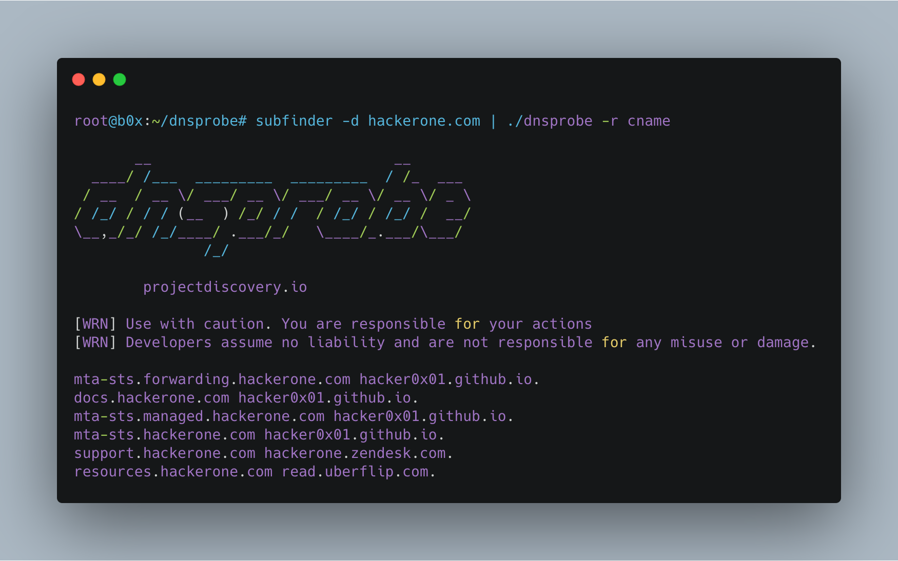

<h1 align="left">
  </a>
  <br>
</h1>

[](https://opensource.org/licenses/MIT)
[](https://goreportcard.com/report/github.com/projectdiscovery/dnsprobe)
[](https://github.com/projectdiscovery/dnsprobe/issues)

DNSProbe is a tool built on top of [retryabledns](https://github.com/projectdiscovery/retryabledns) that allows you to perform multiple dns queries of your choice with a list of user supplied resolvers.

# Resources
- [Resources](#resources)
- [Features](#features)
- [Usage](#usage)
- [Installation Instructions](#installation-instructions)
    - [From Source](#from-source)
    - [Running in a Docker Container](#running-in-a-docker-container)
    - [Querying host for A record](#querying-host-for-a-record)
    - [Querying host for CNAME record](#querying-host-for-cname-record)
    - [Querying CNAME records on the Subfinder output](#querying-cname-records-on-the-subfinder-output)
- [License](#license)

# Features

<h1 align="left">
  </a>
  <br>
</h1>

 - Simple and Handy utility to query DNS records. 
 

# Usage

```bash
dnsprobe -h
```
This will display help for the tool. Here are all the switches it supports.

| Flag           | Description                                                        | Example                                     |
|----------------|------------------------------------------------------------------------------------------------------------------|---------------------------|
| -c             | Max dns retries (default 1)                                                                                      | dnsprobe -c 5             |
| -l             | List of dns domains (optional)                                                                                              | dnsprobe -l domains.txt                     |
| -r             | Request Type A, NS, CNAME, SOA, PTR, MX, TXT, AAAA (default "A")                                                 | dnsprobe -r A                               |
| -s             | List of resolvers (optional)                                                                                                | dnsprobe -s resolvers.txt                   |
| -t             | Number of concurrent requests to make (default 250)                                                              | dnsprobe -t 500                             |
| -f             | Output type: ip, domain, response, simple (domain + ip, default), full (domain + response), json (domain + raw response)  | dnsprobe -f json           |
| -o             | Output file (optional)                                                                                                      | dnsprobe -o result.txt                                |
| -raw           | Output the full response ignoring output type                                                                  | dnsprobe -raw               |
| -silent        | Show only found results in output                     | dnsprobe -silent             |

# Installation Instructions
### From Source

dnsprobe requires go1.13+ to install successfully. Run the following command to get the repo -

```curl
GO111MODULE=on go get -u -v github.com/projectdiscovery/dnsprobe
```

In order to update the tool, you can use -u flag with go get command.

### Running in a Docker Container

- Clone the repo using `git clone https://github.com/projectdiscovery/dnsprobe.git`
- Build your docker container
```bash
> docker build -t projectdiscovery/dnsprobe .
```

- After building the container using either way, run the following - 
```bash
> docker run -it projectdiscovery/dnsprobe
```

For example, to query a list of domains for CNAME record and output the results to your host file system:
```bash
> cat domains.txt | docker run -i projectdiscovery/dnsprobe -r CNAME > bugcrowd.txt
```

### Querying host for A record

To query a list of domains, you can pass the list via stdin (it also accepts full URLS, in this case the domain is extracted automatically).

```bash
> cat domains.txt | dnsprobe

root@test:~# cat bc.txt | dnsprobe
bounce.bugcrowd.com 192.28.152.174
blog.bugcrowd.com 104.20.4.239
blog.bugcrowd.com 104.20.5.239
www.bugcrowd.com 104.20.5.239
www.bugcrowd.com 104.20.4.239
events.bugcrowd.com 54.84.134.174
```

### Querying host for CNAME record

```bash
> dnsprobe -l domains.txt -r CNAME

root@test:~# dnsprobe -l bc.txt -r CNAME
forum.bugcrowd.com bugcrowd.hosted-by-discourse.com.
collateral.bugcrowd.com bugcrowd.outrch.com.
go.bugcrowd.com mkto-ab270028.com.
ww2.bugcrowd.com bugcrowdinc.mktoweb.com.
researcherdocs.bugcrowd.com ssl.readmessl.com.
docs.bugcrowd.com ssl.readmessl.com.
```

This will run the tool against domains in `domains.txt` and returns the results. The tool uses the resolvers specified with -s option to perform the queries or default system resolvers.

### Querying CNAME records on the Subfinder output

```bash 
> subfinder -d bugcrowd.com -silent | dnsprobe -r cname

root@b0x:~# subfinder -d bugcrowd.com -silent | dnsprobe -r cname
forum.bugcrowd.com bugcrowd.hosted-by-discourse.com.
docs.bugcrowd.com ssl.readmessl.com.
go.bugcrowd.com mkto-ab270028.com.
ww2.bugcrowd.com bugcrowdinc.mktoweb.com.
researcherdocs.bugcrowd.com ssl.readmessl.com.
collateral.bugcrowd.com bugcrowd.outrch.com.
proxilate.bugcrowd.com proxilate.a.bugcrowd.com.
```

# License

DNSProbe is made with 🖤 by the [projectdiscovery](https://projectdiscovery.io) team.
