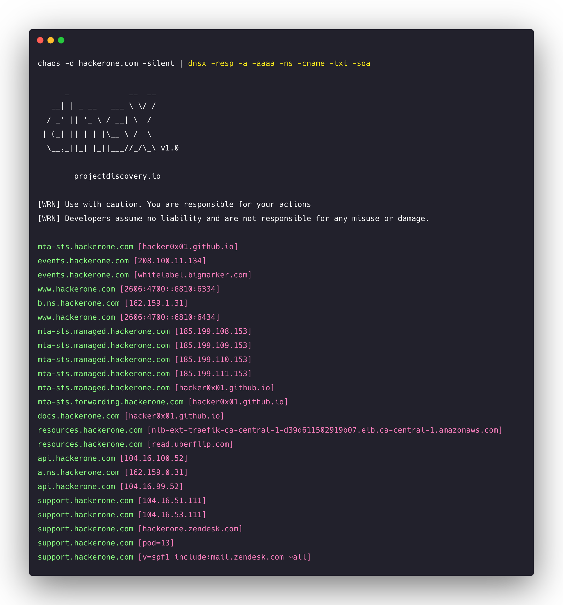

<h1 align="center">
  </a>
  <br>
</h1>


[](https://opensource.org/licenses/MIT)
[](https://goreportcard.com/report/github.com/projectdiscovery/dnsx)
[](https://github.com/projectdiscovery/dnsx/issues)
[](https://github.com/projectdiscovery/dnsx/releases)
[](https://formulae.brew.sh/formula/dnsx)
[](https://twitter.com/pdiscoveryio)
[](https://discord.gg/KECAGdH)

**dnsx** is a fast and multi-purpose DNS toolkit allow to run multiple probers using [retryabledns](https://github.com/projectdiscovery/retryabledns) library, that allows you to perform multiple DNS queries of your choice with a list of user supplied resolvers.

dnsx is successor of [dnsprobe](https://github.com/projectdiscovery/dnsprobe) that includes new features, multiple bugs fixes, and tailored for better user experience, few notable flags are `resp` and `resp-only` that allows to control and print the exact information you are looking for.

We also ported DNS wildcard filtering feature to dnsx from [shuffledns](https://github.com/projectdiscovery/shuffledns) as a standalone support.

# Resources

- [Resources](#resources)
- [Features](#features)
- [Usage](#usage)
- [Installation Instructions](#installation-instructions)
    - [From Source](#from-source)
    - [From Source](#from-source-1)
    - [From Github](#from-github)
    - [Install via brew](#install-via-brew)
    - [Running dnsx](#running-dnsx)
    - [Wildcard filtering](#wildcard-filtering)
- [📋 Notes](#-notes)


# Features

<h1 align="left">
  </a>
  <br>
</h1>


 - Simple and Handy utility to query DNS records.
 - Supports **A, AAAA, CNAME, PTR, NS, MX, TXT, SOA**
 - Handles wildcard subdomains in automated way.
 - Optimized for **ease of use**.
 - **Stdin** and **stdout** support to work with other tools.

# Usage

```sh
dnsx -h
```

This will display help for the tool. Here are all the switches it supports.

| Flag      | Description                        | Example               |
| --------- | ---------------------------------- | --------------------- |
| a         | Query A record                     | dnsx -a               |
| aaaa      | Query AAAA record                  | dnsx -aaaa            |
| cname     | Query CNAME record                 | dnsx -cname           |
| ns        | Query NS record                    | dnsx -ns              |
| ptr       | Query PTR record                   | dnsx -ptr             |
| txt       | Query TXT record                   | dnsx -txt             |
| mx        | Query MX record                    | dnsx -mx              |
| soa       | Query SOA record                   | dnsx -soa             |
| raw       | Operates like dig                  | dnsx -raw             |
| l         | File input list of subdomains/host | dnsx -l list.txt      |
| json      | JSON output                        | dnsx -json            |
| r         | File or comma separated resolvers  | dnsx -r 1.1.1.1       |
| rl        | Limit of DNS request/second        | dnsx -rl 100          |
| resp      | Display response data              | dnsx -cname -resp     |
| resp-only | Display only response data         | dnsx -cname resp-only |
| retry     | Number of DNS retries              | dnsx -retry 1         |
| silent    | Show only results in the output    | dnsx -silent          |
| o         | File to write output to (optional) | dnsx -o output.txt    |
| t         | Concurrent threads to make         | dnsx -t 250           |
| verbose   | Verbose output                     | dnsx -verbose         |
| version   | Show version of dnsx               | dnsx -version         |
| wd        | Wildcard domain name for filtering | dnsx -wd example.com  |
| wt        | Wildcard Filter Threshold          | dnsx -wt 5            |


# Installation Instructions

### From Source

The installation is easy. You can download the pre-built binaries for your platform from the [Releases](https://github.com/projectdiscovery/dnsx/releases/) page. Extract them using tar, move it to your `$PATH`and you're ready to go.

```sh
Download latest binary from https://github.com/projectdiscovery/dnsx/releases

▶ tar -xvf dnsx-linux-amd64.tar
▶ mv dnsx-linux-amd64 /usr/local/bin/dnsx
▶ dnsx -h
```

### From Source

**dnsx** requires **go1.15+** to install successfully. Run the following command to get the repo -

```sh
▶ GO111MODULE=on go get -v github.com/projectdiscovery/dnsx/cmd/dnsx
```

### From Github

```sh
▶ git clone https://github.com/projectdiscovery/dnsx.git; cd dnsx/cmd/dnsx; go build; mv dnsx /usr/local/bin/; dnsx -version
```

### Install via brew

If you're macOS user and using [Homebrew](https://brew.sh/), you can install via `brew` command:

```sh
$ brew install dnsx
```

### Running dnsx

**dnsx** can be used to filter dead records from the list of passive subdomains obtained from various sources, for example:-

```sh
▶ subfinder -silent -d hackerone.com | dnsx

      _             __  __
   __| | _ __   ___ \ \/ /
  / _' || '_ \ / __| \  /
 | (_| || | | |\__ \ /  \
  \__,_||_| |_||___//_/\_\ v1.0

    projectdiscovery.io

[WRN] Use with caution. You are responsible for your actions
[WRN] Developers assume no liability and are not responsible for any misuse or damage.

a.ns.hackerone.com
www.hackerone.com
api.hackerone.com
docs.hackerone.com
mta-sts.managed.hackerone.com
mta-sts.hackerone.com
resources.hackerone.com
b.ns.hackerone.com
mta-sts.forwarding.hackerone.com
events.hackerone.com
support.hackerone.com
```

**dnsx** can be used to extract **A** records for the given list of subdomains, for example:-

```sh
▶ subfinder -silent -d hackerone.com | dnsx -silent -a -resp

a.ns.hackerone.com [162.159.0.31]
b.ns.hackerone.com [162.159.1.31]
mta-sts.hackerone.com [185.199.108.153]
events.hackerone.com [208.100.11.134]
mta-sts.managed.hackerone.com [185.199.108.153]
resources.hackerone.com [52.60.160.16]
resources.hackerone.com [52.60.165.183]
www.hackerone.com [104.16.100.52]
support.hackerone.com [104.16.53.111]
```

**dnsx** can be used to extract **CNAME** records for the given list of subdomains, for example:-

```sh
▶ subfinder -silent -d hackerone.com | dnsx -silent -cname -resp

support.hackerone.com [hackerone.zendesk.com]
resources.hackerone.com [read.uberflip.com]
mta-sts.hackerone.com [hacker0x01.github.io]
mta-sts.forwarding.hackerone.com [hacker0x01.github.io]
events.hackerone.com [whitelabel.bigmarker.com]
```

**dnsx** can be used to extract subdomains from given network range using `PTR` query, for example:-

```sh
mapcidr -cidr 173.0.84.0/24 -silent | dnsx -silent -resp-only -ptr

cors.api.paypal.com
trinityadminauth.paypal.com
cld-edge-origin-api.paypal.com
appmanagement.paypal.com
svcs.paypal.com
trinitypie-serv.paypal.com
ppn.paypal.com
pointofsale-new.paypal.com
pointofsale.paypal.com
slc-a-origin-pointofsale.paypal.com
fpdbs.paypal.com
```


### Wildcard filtering

A special feature of **dnsx** is its ability to handle **multi-level DNS based wildcards** and do it so with very less number of DNS requests. Sometimes all the subdomains will resolve which will lead to lots of garbage in the results. The way **dnsx** handles this is it will keep track of how many subdomains point to an IP and if the count of the Subdomains increase beyond a certain small threshold, it will check for wildcard on all the levels of the hosts for that IP iteratively.

```sh
dnsx -l airbnb-subs.txt -wd airbnb.com -o output.txt
```

# 📋 Notes

- As default, **dnsx** checks for **A** record.
- As default dnsx uses Google, Cloudflare, Quad9 [resolver](https://github.com/projectdiscovery/dnsx/blob/43af78839e237ea8cbafe571df1ab0d6cbe7f445/libs/dnsx/dnsx.go#L31).
- Domain name input is mandatory for wildcard elimination.
- DNS record flag can not be used when using wildcard filtering.

dnsx is made with 🖤 by the [projectdiscovery](https://projectdiscovery.io) team.
